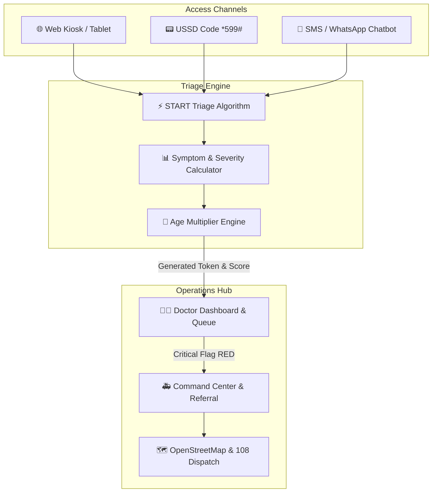

# 🏥 Swasthya Queue

<div align="center">

### AI-Powered Teleconsultation, Triage & Emergency Referral Platform

Designed for Rural Primary Health Centres (PHCs) to streamline patient prioritization, teleconsultation workflows, and emergency referrals.

[](https://swasthya-queue.netlify.app/)


🌐 **Live Demo:** https://swasthya-queue.netlify.app/

</div>

---

## 📖 Overview

Swasthya Queue is an intelligent healthcare workflow platform built to address challenges faced by rural healthcare centres, including patient overcrowding, delayed triage, limited specialist availability, and inefficient referral systems.

The platform combines:

* Smart patient triage
* Dynamic queue management
* Teleconsultation support
* Emergency referral workflows
* Multi-channel accessibility
* Offline-first operations

to help healthcare providers deliver faster and more efficient care.

---

## 📑 Table of Contents

* Overview
* Problem Statement
* Key Features
* System Architecture
* Access Channels
* Triage Priority Model
* Doctor Dashboard Credentials
* Technology Stack
* Getting Started
* Browser Support
* Project Structure
* Roadmap
* Contributing
* License

---

## 🎯 Problem Statement

Rural Primary Health Centres often struggle with:

* High patient volumes
* Delayed identification of critical cases
* Manual queue management
* Connectivity limitations
* Inefficient emergency referral coordination

These challenges can result in delayed treatment for patients who require urgent medical attention.

Swasthya Queue introduces a structured triage and referral ecosystem to improve operational efficiency and patient outcomes.

---

## ✨ Key Features

### Smart Triage Engine

* START-inspired triage algorithm
* Dynamic patient prioritization
* Real-time queue reordering
* Age-sensitive risk scoring
* Automated severity classification

### Multi-Channel Patient Registration

* 🌐 Web Portal
* 📟 USSD (*599#)
* 💬 WhatsApp
* 📱 SMS

### Doctor Dashboard

* Secure clinician login
* Live patient queue
* AI-generated patient summaries
* Teleconsultation workflow
* Patient messaging
* Referral escalation

### Emergency Command Center

* Hospital matching
* Bed availability tracking
* Ambulance dispatch workflow
* Referral management
* Real-time status monitoring

### Offline-First Operations

* Local data persistence
* Connectivity monitoring
* Automatic synchronization
* Recovery after network interruption

### Multi-Language Accessibility

* English
* Hindi
* Tamil
* Telugu
* Kannada

---

## 🏗️ System Architecture & Data Flow



## 📁 Repository Structure

```
swasthya-queue/
├── .github/
│   └── workflows/
│       └── deploy.yml          # GitHub Actions CI/CD deployment workflow
├── .vscode/
│   └── settings.json           # VS Code recommended settings
├── public/
│   ├── manifest.json           # Progressive Web App (PWA) manifest
│   └── service-worker.js       # PWA offline cache service worker
├── src/
│   ├── css/
│   │   ├── variables.css       # Design tokens & color palettes
│   │   ├── base.css            # Base resets & layout grids
│   │   ├── components.css     # Buttons, cards, modals, tickets
│   │   ├── navbar.css          # Navigation bar & language widget
│   │   ├── patient.css         # Registration, USSD, SMS styles
│   │   ├── doctor.css          # Doctor dashboard & video call styles
│   │   ├── dispatch.css        # Command center & map styles
│   │   └── about.css           # How it works & scoring table
│   └── js/
│       ├── config.js           # Constants & USSD dictionaries
│       ├── api.js              # APIService mock engine & ML triage
│       ├── theme.js            # Dark mode & online status listeners
│       ├── translate.js        # Google Translate integration
│       ├── auth.js             # Role-based login modal & security
│       ├── patient-flow.js     # Web wizard, USSD, SMS simulators
│       ├── doctor-flow.js      # Live queue renderer & video overlay
│       ├── dispatch-flow.js    # OpenStreetMap Leaflet & bed booking
│       └── app.js              # Application entry point & router
├── LICENSE                     # MIT Open Source License
├── README.md                   # Project documentation
├── index.html                  # Main HTML entry point
├── package.json                # NPM project dependencies & scripts
└── vite.config.js              # Vite server & build configuration
```
---

## 🚑 Access Channels

| Channel      | Connectivity Requirement | Target Users             |
| ------------ | ------------------------ | ------------------------ |
| Web Portal   | Internet Available       | Clinics & Health Workers |
| USSD (*599#) | No Internet Required     | Rural Communities        |
| WhatsApp     | Smartphone Users         | Remote Patients          |
| SMS          | Basic Phones             | Low-Connectivity Areas   |

---

## 🚨 Triage Priority Model

| Priority  | Category | Action                |
| --------- | -------- | --------------------- |
| 🔴 RED    | Critical | Immediate Attention   |
| 🟠 ORANGE | Moderate | Priority Consultation |
| 🟢 GREEN  | Routine  | Standard Queue        |

### Scoring Framework

| Clinical Factor         | Score    |
| ----------------------- | -------- |
| Chest Pain              | +4       |
| Breathlessness          | +4       |
| Seizure                 | +4       |
| High Fever              | +2       |
| Severe Headache         | +2       |
| Injury                  | +2       |
| Vomiting                | +1       |
| Abdominal Pain          | +1       |
| Common Cold             | +1       |
| Patient Severity Rating | +1 to +5 |
| Age Risk Multiplier     | ×1.5     |

---

## 👨‍⚕️ Doctor Dashboard Credentials

| Field    | Value       |
| -------- | ----------- |
| Username | `doctor`    |
| Password | `doctor123` |

---

## 🛠️ Technology Stack

### Frontend

* HTML5
* CSS3
* JavaScript (ES6)

### Mapping & Geospatial Services

* Leaflet.js
* OpenStreetMap

### Communication Channels

* USSD Workflow Simulation
* SMS Workflow Simulation
* WhatsApp Workflow Simulation

### Localization

* Google Translate Widget

### Typography

* Inter
* Outfit

---
---

## 🎓 Academic Evaluation & Credentials

If you are evaluating this repository for academic review or grading, please refer to the dedicated **[EVALUATION_GUIDE.md](EVALUATION_GUIDE.md)** for a 5-minute step-by-step walkthrough.

### Test Credentials:
- **Doctor Dashboard Access**:
  - **Username**: `doctor`
  - **Password**: `doctor123`

---

## 📄 License

This project is licensed under the [MIT License](LICENSE) — free for educational, academic, and research use.
