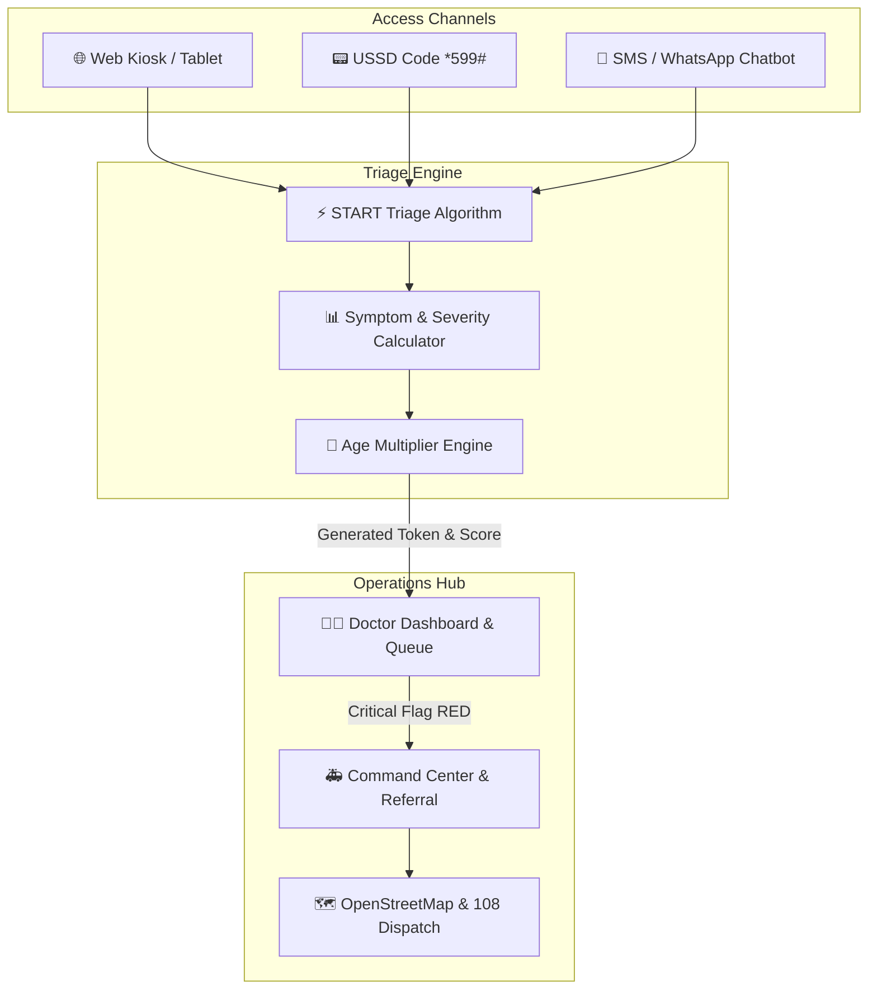

# 🏥 Swasthya Queue — Rural Teleconsultation & Emergency Triage OS

[](LICENSE)
[](public/manifest.json)
[%20%7C%20Leaflet-blue.svg)](#technology-stack)
[](#academic-evaluation)

> **Swasthya Queue** is an AI-inspired, multi-channel teleconsultation triage and emergency referral operating system engineered for Primary Health Centres (PHCs) in rural India. It bridges the gap between remote patients and doctors through instant triage across **Web Kiosks, USSD keypad codes (*599#), and SMS/WhatsApp Chatbots**.

---

## 📌 Problem Statement & Significance

In rural healthcare settings across India:
1. **Long Waiting Times & Overcrowding**: Patients wait hours at PHCs without prior symptom assessment.
2. **Limited Connectivity**: Over 40% of rural patients use 2G feature phones without internet access.
3. **Delayed Critical Referrals**: Severe conditions (like Acute Coronary Syndrome or Seizures) are often identified late due to unsorted queues.

**Swasthya Queue solves this by:**
- Providing **1-second automated triage scoring** using a START-inspired algorithm.
- Enabling zero-internet registration via **USSD (`*599#`)** and **SMS/WhatsApp Chatbots**.
- Giving doctors a **real-time prioritized queue** with 3-sentence AI summary briefs and vital stats.
- Enabling **one-tap 108 ambulance dispatch** and hospital ICU bed reservation with live OpenStreetMap tracking.

---

## 🏗️ System Architecture & Data Flow



---

## ✨ Key Features Matrix

| Module | Feature | Target User / Infrastructure | Key Technology |
| :--- | :--- | :--- | :--- |
| **Patient Registration** | Web Kiosk Wizard | PHC Tablet / Smartphone | Dynamic DOM Wizard, Multilingual Dropdown |
| **Offline Access** | USSD Simulator (`*599#`) | 2G Feature Phones (Keypad) | Keypad State Machine, Instant SMS Fallback |
| **Conversational UI** | SMS / WhatsApp Chatbot | Literate Users / Basic Messaging | Async Chatbot Flow Engine |
| **Doctor Dashboard** | Auto-Prioritized Queue | Teleconsultation Medical Staff | Dynamic Sorting (`RED` / `ORANGE` / `GREEN`) |
| **Clinical Briefs** | AI Vital Summaries | Doctors / Health Workers | Automated Brief Generator |
| **Tele-consultation** | Video Overlay & Messaging | Remote Doctor & Patient | Simulated WebRTC Overlay |
| **Emergency Referral** | Live Bed & 108 Dispatch | Command Center Supervisors | Leaflet.js / OpenStreetMap Real-time Radar |
| **Accessibility** | Multilingual & Dark Mode | All Stakeholders | Google Translate API & CSS Custom Properties |

---

## 🧮 Triage Scoring Algorithm Breakdown

The platform implements a START-inspired triage scoring model:

| Factor / Symptom | Points / Logic | Priority Tier |
| :--- | :--- | :--- |
| **Critical Symptoms** (*Chest Pain, Breathlessness, Seizure*) | `+4 points` each | **RED (Critical)**: Score $\ge 8$ |
| **Moderate Symptoms** (*Fever, Severe Headache, Injury*) | `+2 points` each | **ORANGE (Urgent)**: Score $4 - 7$ |
| **Mild Symptoms** (*Cold, Vomiting, Abdominal Pain*) | `+1 point` each | **GREEN (Routine)**: Score $1 - 3$ |
| **Age Vulnerability** (*Age $> 60$ or $< 5$ years*) | `× 1.5 multiplier` | Automatic priority escalation |
| **Patient Discomfort Rating** | `+1 to +5 points` | Self-reported severity scale |

---

## 📁 Repository Structure

```
swasthya-queue/
├── .github/
│   └── workflows/
│       └── deploy.yml          # GitHub Actions CI/CD deployment workflow
├── .vscode/
│   └── settings.json           # VS Code recommended settings
├── public/
│   ├── manifest.json           # Progressive Web App (PWA) manifest
│   └── service-worker.js       # PWA offline cache service worker
├── src/
│   ├── css/
│   │   ├── variables.css       # Design tokens & color palettes
│   │   ├── base.css            # Base resets & layout grids
│   │   ├── components.css     # Buttons, cards, modals, tickets
│   │   ├── navbar.css          # Navigation bar & language widget
│   │   ├── patient.css         # Registration, USSD, SMS styles
│   │   ├── doctor.css          # Doctor dashboard & video call styles
│   │   ├── dispatch.css        # Command center & map styles
│   │   └── about.css           # How it works & scoring table
│   └── js/
│       ├── config.js           # Constants & USSD dictionaries
│       ├── api.js              # APIService mock engine & ML triage
│       ├── theme.js            # Dark mode & online status listeners
│       ├── translate.js        # Google Translate integration
│       ├── auth.js             # Role-based login modal & security
│       ├── patient-flow.js     # Web wizard, USSD, SMS simulators
│       ├── doctor-flow.js      # Live queue renderer & video overlay
│       ├── dispatch-flow.js    # OpenStreetMap Leaflet & bed booking
│       └── app.js              # Application entry point & router
├── EVALUATION_GUIDE.md         # Dedicated guide for evaluator/teacher testing
├── LICENSE                     # MIT Open Source License
├── README.md                   # Project documentation
├── index.html                  # Main HTML entry point
├── package.json                # NPM project dependencies & scripts
└── vite.config.js              # Vite server & build configuration
```

---

## 🚀 Quick Start & Installation

### Prerequisites
- Node.js (v18 or higher recommended)
- NPM or UV package manager

### Local Setup Instructions

1. **Clone the Repository**:
   ```bash
   git clone https://github.com/your-username/swasthya-queue.git
   cd swasthya-queue
   ```

2. **Install Dependencies**:
   ```bash
   npm install
   ```

3. **Launch Local Development Server**:
   ```bash
   npm run dev
   ```
   *The app will automatically open at `http://localhost:3000`.*

4. **Build Production Bundle**:
   ```bash
   npm run build
   ```

---

## 🎓 Academic Evaluation & Credentials

If you are evaluating this repository for academic review or grading, please refer to the dedicated **[EVALUATION_GUIDE.md](EVALUATION_GUIDE.md)** for a 5-minute step-by-step walkthrough.

### Test Credentials:
- **Doctor Dashboard Access**:
  - **Username**: `doctor`
  - **Password**: `doctor123`

---

## 📄 License

This project is licensed under the [MIT License](LICENSE) — free for educational, academic, and research use.
